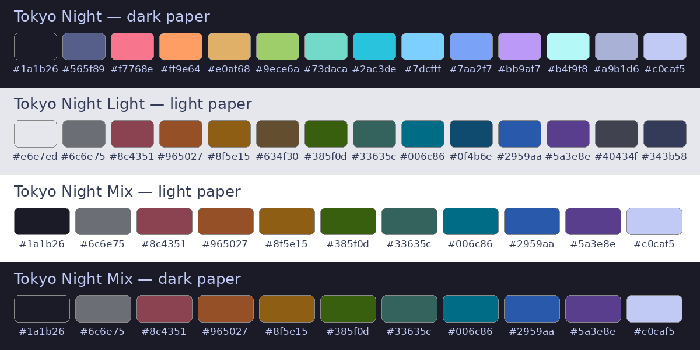

# Tokyo Night for Xournal++

Pen palettes for [Xournal++](https://xournalpp.github.io/), taken from
[enkia's Tokyo Night](https://github.com/tokyo-night/tokyo-night-vscode-theme)
VS Code theme (default Night variant, `#1a1b26`).

Three files, pick by paper:

- `tokyo-night.gpl`: dark paper. Full glow, unreadable on white.
- `tokyo-night-light.gpl`: light paper.
- `tokyo-night-mix.gpl`: daily driver. Readable on white, light, dark, and black paper. Muted on dark, no glow.

Why three: an ink bright enough to glow on dark paper is too close to white to read on white paper. The Mix trades glow for readability. Mid-grey paper beats every color, so it is left out.

## Install

Copy the `.gpl` files to the `palettes` folder in your Xournal++ config folder
(`~/.config/xournalpp/palettes/` on Linux). Restart Xournal++, then pick one in
`Edit > Preferences > Palette`.

Match the page too: `Journal > Configure Page Template`, background `#1a1b26`
for Night, `#e6e7ed` for Light.

## Palettes

### Tokyo Night, dark paper

| Color | Hex |
| --- | --- |
| Background | `#1a1b26` |
| Comment | `#565f89` |
| Red | `#f7768e` |
| Orange | `#ff9e64` |
| Yellow | `#e0af68` |
| Green | `#9ece6a` |
| Teal | `#73daca` |
| Cyan | `#2ac3de` |
| Light Blue | `#7dcfff` |
| Blue | `#7aa2f7` |
| Magenta | `#bb9af7` |
| Light Cyan | `#b4f9f8` |
| Editor Foreground | `#a9b1d6` |
| Foreground | `#c0caf5` |

### Tokyo Night Light, light paper

| Color | Hex |
| --- | --- |
| Background | `#e6e7ed` |
| Comment | `#6c6e75` |
| Red | `#8c4351` |
| Orange | `#965027` |
| Yellow | `#8f5e15` |
| Tan | `#634f30` |
| Green | `#385f0d` |
| Teal | `#33635c` |
| Cyan | `#006c86` |
| Light Blue | `#0f4b6e` |
| Blue | `#2959aa` |
| Magenta | `#5a3e8e` |
| Text | `#40434f` |
| Foreground | `#343b58` |

### Tokyo Night Mix, all papers

| Color | Hex | Source |
| --- | --- | --- |
| Ink Dark | `#1a1b26` | Night Background |
| Grey | `#6c6e75` | Light Comment |
| Red | `#8c4351` | Light |
| Orange | `#965027` | Light |
| Yellow | `#8f5e15` | Light |
| Green | `#385f0d` | Light |
| Teal | `#33635c` | Light |
| Cyan | `#006c86` | Light |
| Blue | `#2959aa` | Light |
| Magenta | `#5a3e8e` | Light |
| Ink Light | `#c0caf5` | Night Foreground |

## Credits

Colors by [enkia](https://github.com/tokyo-night/tokyo-night-vscode-theme)
([MIT](https://github.com/tokyo-night/tokyo-night-vscode-theme/blob/master/LICENSE)).
Layout copied from the [Dracula Xournal++ port](https://draculatheme.com/xournalpp).

## License

MIT, see [LICENSE](LICENSE).
